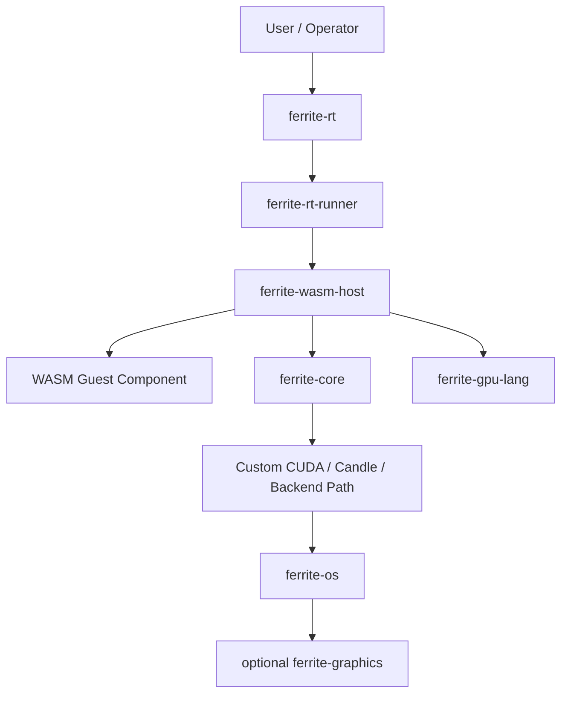
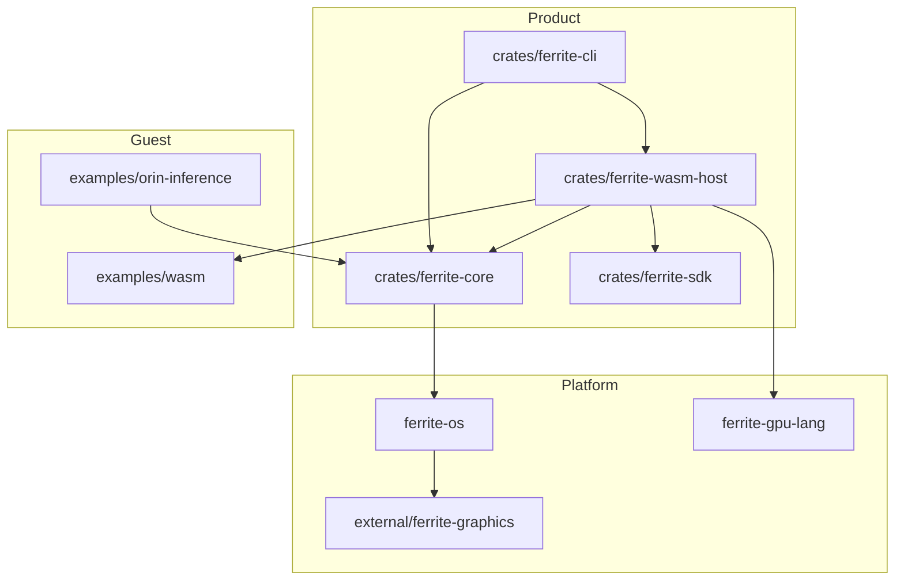
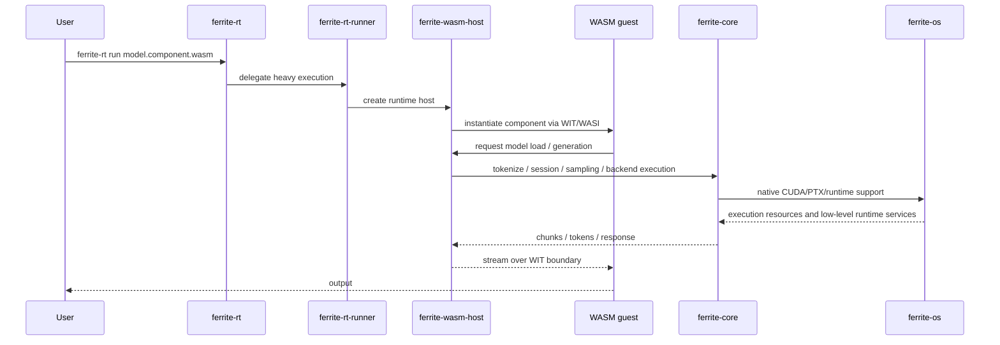
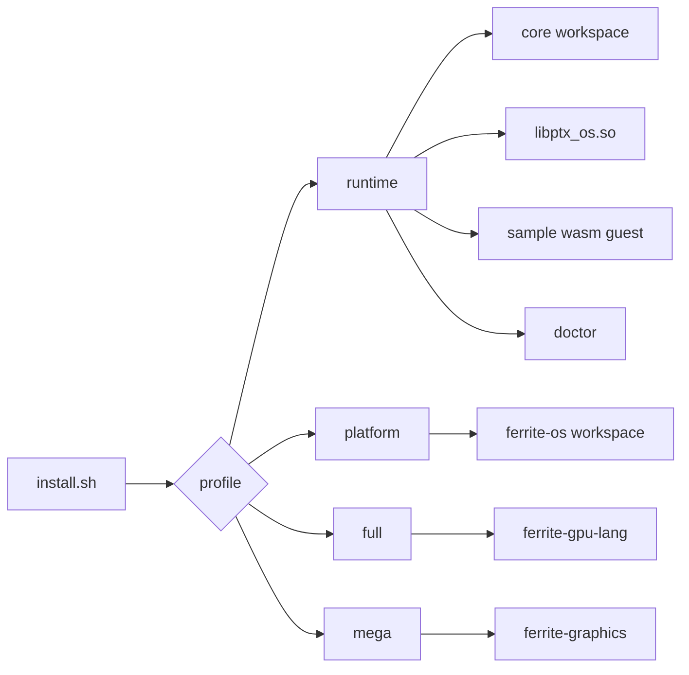

# Ferrite Architecture

This document answers the practical question:

`what is this thing, structurally?`

## Short Answer

Ferrite is a vertically integrated AI runtime engine.

It is not just:

- an LLM app
- a CLI wrapper around a model
- a single inference crate

It is a full stack that combines:

- operator/admin tooling
- runtime dispatch
- a WASM guest boundary
- a native inference engine
- CUDA/PTX runtime substrate
- a programmable GPU layer
- optional platform extensions

## Plain-Language Model

If you need the blunt version:

`Ferrite is an AI engine tree with OS-like layering over GPU execution.`

It is still hosted on Linux, CUDA, and Wasmtime, so it is not a literal
operating system kernel. But architecturally it behaves more like a vertical
platform stack than a normal app repo.

## Top-Level Stack

## Repo Layering

## Runtime Execution Path

## What Each Major Piece Does

### `crates/ferrite-cli`

This is the operator surface.

- `ferrite-rt`: lightweight admin front-end
- `ferrite-rt-runner`: heavy runtime execution path
- owns `doctor`, `setup`, `info`, `cache`, and dispatch into runtime execution

### `crates/ferrite-wasm-host`

This is the boundary manager.

- exposes host functions to the guest
- bridges WIT/WASM calls into native execution
- hosts script hooks
- can bridge into `ferrite-gpu-lang` for selected hook paths

### `crates/ferrite-core`

This is the inference engine.

- model registry and loading
- tokenizer/session logic
- sampling and generation
- backend policy
- CUDA/custom kernel path

### `ferrite-os`

This is the lower substrate.

- native PTX/CUDA runtime pieces
- shared libraries like `libptx_os.so`
- public/internal runtime and compute crates
- platform-facing execution infrastructure

### `ferrite-gpu-lang`

This is the programmable GPU layer.

- graph/JIT/script-style execution
- extension seam for GPU-side logic
- current integration path for scripted logits behavior

### `external/ferrite-graphics`

This is the optional extended subsystem.

- heavier native/toolchain path
- included in full-engine installs via `mega`

## Why The Repo Feels OS-Like

Ferrite owns more than inference code.

It owns:

- installation
- validation
- runtime policy
- host/guest execution boundaries
- native runtime pieces
- optional platform subsystems

That is why it reads less like an app and more like a stack.

## What Ferrite Is Not

Ferrite is not:

- a Linux replacement
- a kernel
- a pure crate library with no operational surface
- a bunch of unrelated experiments sharing a folder

The intended reading is:

`one engine tree, many layers, one install surface`

## Install/Build Shape

## Current Design Intent

The default one-line installer builds the full engine stack.

That means the product story is:

- one installer
- one engine checkout
- one stack available locally

Profiles still exist, but they are explicit narrower slices of the same engine.

## Practical Reading Guide

If you are new to the repo, read it in this order:

1. [`README.md`](/home/daron/llm_engine/fer_llm/ferrite/README.md)
2. [Running Ferrite](/home/daron/llm_engine/fer_llm/ferrite/docs/RUNNING.md)
3. [Engine Identity](/home/daron/llm_engine/fer_llm/ferrite/docs/ENGINE_IDENTITY.md)
4. subsystem READMEs for the part you are touching
