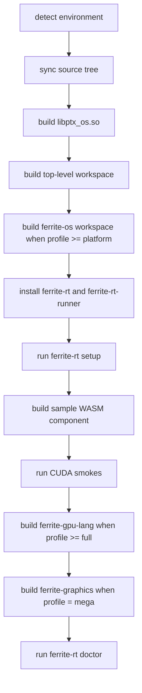

# Installer Architecture

Ferrite is one engine tree, but it is not one flat build graph.

The installer therefore needs to understand the repo as layered modules inside
the same engine, not as a pile of unrelated folders.

## Design Goal

The plain one-line installer should mean:

`build the whole Ferrite engine`

That is now the default `mega` profile.

Narrower profiles still exist, but they are explicit opt-downs:

- `runtime`
- `platform`
- `full`
- `mega`

## Repo Build Layers

### Runtime product layer

- [`crates/ferrite-cli`](/home/daron/llm_engine/fer_llm/ferrite/crates/ferrite-cli)
- [`crates/ferrite-wasm-host`](/home/daron/llm_engine/fer_llm/ferrite/crates/ferrite-wasm-host)
- [`crates/ferrite-core`](/home/daron/llm_engine/fer_llm/ferrite/crates/ferrite-core)
- [`crates/ferrite-sdk`](/home/daron/llm_engine/fer_llm/ferrite/crates/ferrite-sdk)
- [`examples/wasm`](/home/daron/llm_engine/fer_llm/ferrite/examples/wasm)

### Platform substrate

- [`ferrite-os`](/home/daron/llm_engine/fer_llm/ferrite/ferrite-os)
- `ferrite-os/lib/libptx_os.so`

### Programmable GPU layer

- [`ferrite-gpu-lang`](/home/daron/llm_engine/fer_llm/ferrite/ferrite-gpu-lang)

### Extended subsystem

- [`external/ferrite-graphics`](/home/daron/llm_engine/fer_llm/ferrite/external/ferrite-graphics)

## Current Profile Contract

### `runtime`

Builds the smallest supported Ferrite runtime slice:

- top-level workspace
- native `libptx_os.so`
- WASM prerequisites
- sample guest component
- CUDA smoke checks
- doctor validation

### `platform`

Adds:

- `ferrite-os` workspace

### `full`

Adds:

- `ferrite-gpu-lang`

### `mega`

Adds:

- `external/ferrite-graphics`

This is the default one-line install path.

## Installer Phases

## Validation Principle

The installer should never silently pretend it built the full engine if it did
not.

So the install summary should always reflect:

- selected profile
- modules built
- modules intentionally skipped by profile
- modules that failed
- doctor result

## Why This Matters

Because Ferrite is sold as one engine tree.

That means the installer is not just a convenience script. It is part of the
engine contract. If the installer shape is ambiguous, the repo identity becomes
ambiguous too.

## Current Policy

The repo now chooses:

- monorepo engine identity
- full-engine default install
- explicit narrower profiles for special cases

That matches the product story much better than a runtime-only default.
